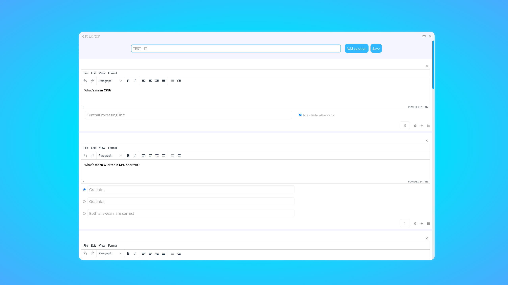

# Testitly

### About Testitly

"Testitly" is a system to create tests and solve them.

### DEMO

;

### Startup

I started with an idea to create my own program which will allow me to create quick tests to study myself. At the very beginning, "Testitly" was working just locally (without any backend). To store data I used [local storage](https://developer.mozilla.org/pl/docs/Web/API/Window/localStorage "See on Mozilla documentation"). The abilities of the application were pretty limited to creating questions without even any text formatting.

### Technologies

"Testitly" application was created with plain frontend languages and backend technologies like so:

- HTML
- CSS (SCSS)
- JavaScript
- NodeJS
- ExpressJS
- PassportJS
- MongoDB
- Scrollbar-smooth (for firefox custom scrollbar support)

After I get some more knowledge about plain JavaScript and backend technologies I decided to rebuild my application with backend at that time.

### Things that need improvement

I wouldn't say that design was my strong point at that time, when I started to create the application, I'm gonna work on that aspect in the future. Due to the windowed design of the application, the admin panel on most mobile devices is blocked from moving the windows, otherwise, that would be pretty chaotic.

### Abilities

Things that I am enjoyed the most are the customization of tests and available options to manage everything.

By signing in to the admin panel we are able to:

- Create Tests - with 3 types of questions and formatted text.
- See our Tests using 'Test viewer'.
- Edit our Test
- Set our Tests public or unpublic.
- Add Test created before by paste **test's code** to "Test uploader".
- Configure our Test that includes:
  - Set exact time of publication of test - for ex. for `09:45 02/12/2022` to `12:45 02/12/2022`
  - Set **limited amount of times** to solve the test. It gets the IP of the computer and checks the solved amount of times (a person can't solve a test more than a specified amount of times)
  - Set bonus lock with **special code**
- After publication, we are able to see people that solved tests and other information.

### Setup

1. Run the command `npm i` or `yarn install`.
1. Register your own database with [mongoDB](https://www.mongodb.com/ "Register on Mongodb Website") database.
1. Create an `.env` file in the root of the project, based on the `.env.example`
1. Run your app using `nodemon server/app`

:point_right: Now you can **Sign in** or **Sign up** to the admin panel of the application, create your tests and manage all of them.

The application should work by default on `http://localhost:3000/`
